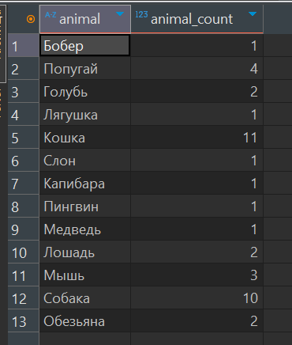
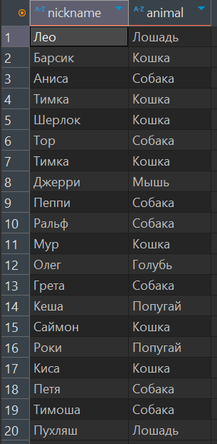

## Запрос 1
#### Запрос возвращает количество животных каждого вида
```sql
select animal, COUNT(*) AS animal_count
from patient
group by animal;
```


## Запрос 2
#### Запрос подсчитывает, количество животных каждого вида и выводит только те виды, количество которых больше или равно пяти
```sql
select animal, COUNT(*) as animal_count
from patient
group by animal
having COUNT(*) >= 5
order by animal_count desc
```


## Запрос 3
#### Запрос выводит id только тех хозяев, количество питомцев у которых больше одного
```sql
select owner_id, COUNT(*) as pets_count
from patient
group by owner_id 
having COUNT(*) > 1
order by owner_id asc
```


## Запрос 4
#### Запрос возвращает питомцев и их хозяев, которые проходили обследование у стоматолога
```sql
select p.nickname, p.animal, p.breed, o.first_name, o.last_name
from patient p
inner join appointment a ON p.patient_id = a.patient_id
inner join doctor d ON a.doctor_id = d.doctor_id
inner join owner o ON p.owner_id = o.owner_id
where d.specialty = 'Стоматолог';
```


## Запрос 5
#### Запрос возвращает питомцев и их хозяев, которые проходили обследование у Кардиолога, больше одного раза, а также имя, фамилию врача
```sql
select p.nickname, p.animal, p.breed, d.first_name as doctor_first_name,
d.last_name as doctor_last_name, o.first_name, o.last_name
from patient p
inner join appointment a on p.patient_id = a.patient_id
inner join doctor d on d.doctor_id = a.doctor_id
inner join owner o on p.patient_id = o.owner_id 
where d.specialty  = 'Кардиолог'
group by p.patient_id, o.owner_id, d.doctor_id
having COUNT(a.appointment_id) > 1
```


## Запрос 6
#### Запрос возвращает питомцев, у которых имеется хотя бы одну вакцинацию
```sql
select p.nickname, p.animal
from patient p
where exists (
    select 1
    from vaccinations v
    where v.patient_id = p.patient_id
);
```


## Запрос 7
#### Запрос возвращает питомцев, у которых кличка Тимка, а также их хозяев
```sql
select o.first_name, o.last_name, p.nickname
from owner o
inner join patient p on o.owner_id = p.owner_id
where p.nickname = 'Тимка';
```


## Запрос 8
#### Запрос возвращает имена по алфавиту, фамилии хозяев, у которых есть питомцы по кличке Пухляш/Тимка/Петя
```sql
select o.first_name, o.last_name, p.nickname
from owner o
inner join patient p on o.owner_id = p.owner_id
where p.nickname in ('Пухляш', 'Тимка', 'Петя')
order by o.first_name asc;
```


## Запрос 9
#### Запрос возвращает кол-во вакцинаций для каждого вакцинированного животного, у которого количество вакцинаций больше одного
```sql
select p.nickname, COUNT(v.vaccinations_id) as vaccination_count
from patient p
inner join vaccinations v ON p.patient_id = v.patient_id
group by p.nickname
having COUNT(v.vaccinations_id) > 1;
```


## Запрос 10
#### Здесь используется оконная функция. Присваиваем номер на основе количества вхождений записи в столбец entry
```sql
select entry, COUNT(*) as entry_count,
       ROW_NUMBER() over (order by COUNT(*) desc) as rank
from medical_history
group by entry
order by entry_count desc
limit 5;
```


## Запрос 11
#### Запрос возвращает имена, фамилии врачей, количество и тип услуг, которые эти врачи оказали
```sql
select d.first_name, d.last_name, cs.type_services, COUNT(*) as service_count
from doctor d
inner join appointment a on d.doctor_id = a.doctor_id
inner join clinic_services cs on a.clinic_services_id = cs.clinic_services_id
group by d.doctor_id, cs.type_services
order by service_count desc;
```
